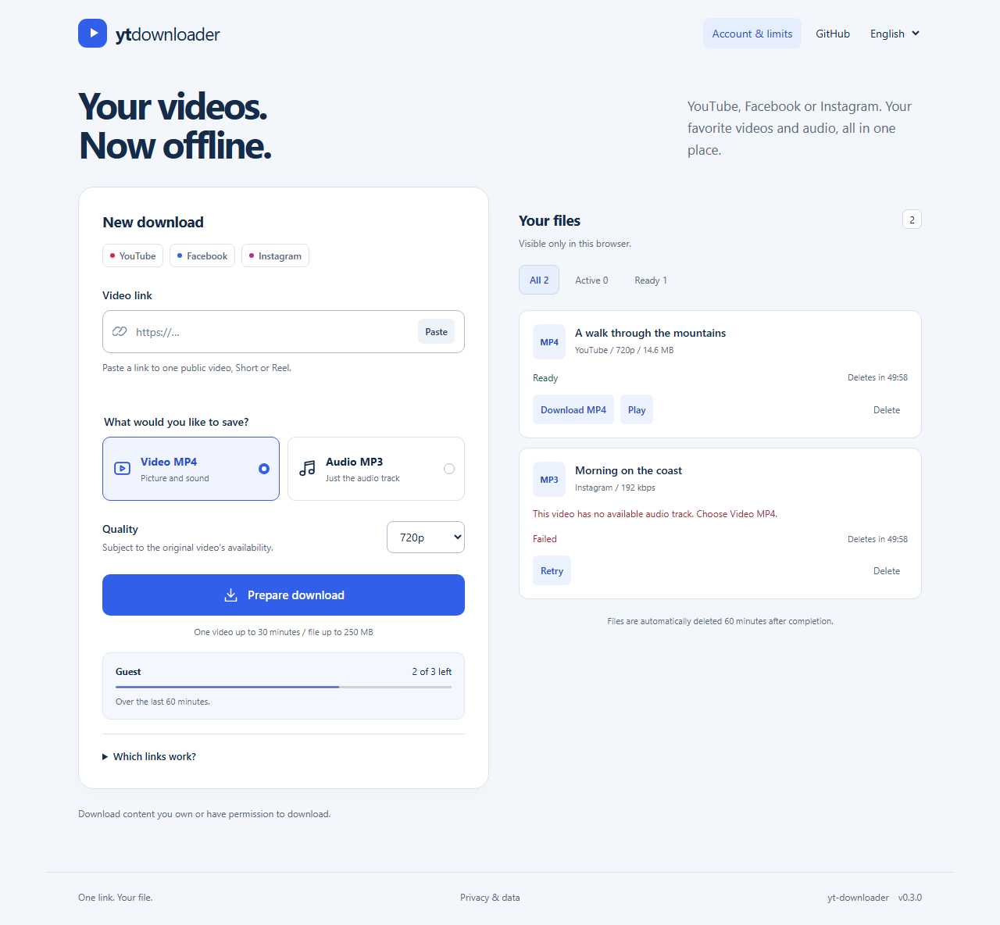

# yt-downloader

[](https://github.com/KasheK420/yt-downloader/actions/workflows/ci.yml)
[](https://github.com/KasheK420/yt-downloader/actions/workflows/codeql.yml)
[](LICENSE)

A self-hosted web app that turns a **YouTube, Facebook, or Instagram** link into an
**MP4 video** or **MP3 audio file**.
Paste a link, choose the format and quality, preview it, and download the result.
Guest access works out of the box; optional Google/Facebook sign-in adds an account library.

Hosted guest instance: **https://ytdown.majorluk.cz**. Facebook MP4/MP3 and Instagram MP4
have passed hosted checks. The tested YouTube source currently requires bot verification
from the VPS; hosted YouTube availability is not established. See [hosted status and operations](docs/PRODUCTION.md).



## Features

- MP4 video (H.264/AAC) up to 360p, 720p, or 1080p; MP3 audio at 128, 192, or 320 kbps.
- Standard YouTube links, youtu.be links, Shorts, and completed live-video links.
- Facebook videos and Reels; Instagram Reels and single-video posts.
- Bounded share-link resolution and automatic provider identification.
- Portrait-aware quality limits: keep the orientation and never upscale the source.
- Queue, progress, cancellation, retry, inline playback, early deletion, and automatic expiry.
- Stable job cards, library filters, remembered format/quality and connection recovery.
- Optional Google/Facebook accounts with logout, all-device logout and account deletion.
- Public guest/free budgets, remaining allowance, rolling reset times and server-side enforcement.
- Czech and English UI, responsive layout, keyboard navigation, and no analytics.
- Revocable browser sessions isolate jobs and downloads between visitors and accounts.
- Rate, queue, duration, storage, and execution-time limits.
- Single Docker service with Python, yt-dlp, FFmpeg, and Node.js included.

Quality is capped by what the source provides. Increasing the MP3 bitrate cannot restore
detail absent from the original audio. Video resolution limits apply to the shorter edge
(720p portrait output is up to 720 x 1280 for a 9:16 source). If the provider only offers a
larger rendition, FFmpeg scales it down. Playlists, carousels, Stories, private videos, and
ongoing live streams are not supported. See [supported sources](docs/SOURCES.md).

MP4 output uses H.264 with 8-bit 4:2:0 pixels and AAC audio when sound is present. AV1,
HEVC and other incompatible streams are converted even when their resolution already fits.
Compatible streams are copied without another lossy encode. The index is placed first for
playback, and every resulting MP4 is fully decoded before completion. Conversion and validation
can take additional time; existing job deadlines and byte limits still apply.

## Start with Docker

Requires Docker Engine/Desktop with Compose v2.

```sh
git clone https://github.com/KasheK420/yt-downloader.git
cd yt-downloader
docker compose up --build -d --wait
```

Open **http://localhost:8080**. The port binds to localhost by default. No `.env` file
or manually managed secret is required; the anonymous session key is generated in the
persistent data volume. For configuration, copy `.env.example` to `.env` and adjust it.

```sh
docker compose logs -f --tail=100
docker compose down
```

`docker compose down` preserves data. Adding `-v` deletes the volume, including history,
temporary files, and the session signing key.

## Native development

Install **Python 3.13**, **uv**, **Node.js 24**, and **FFmpeg with ffprobe** on your PATH.
Node supplies the JavaScript runtime required by current yt-dlp; `yt-dlp-ejs` is locked
in the Python dependencies. The frontend itself has no build step or runtime npm dependencies.

```sh
uv sync --frozen
uv run uvicorn app.main:create_app --factory --host 127.0.0.1 --port 8080 --no-access-log
```

On Windows, if FFmpeg is outside PATH, set `YTD_FFMPEG_LOCATION` to its `bin` directory
in `.env`. The application supports one Uvicorn worker and rejects concurrent schedulers
using the same data directory. Stop the process with Ctrl+C.

## Verify changes

```sh
uv run ruff check .
uv run ruff format --check .
uv run mypy
uv run pytest --cov=app
npm ci
npx playwright install chromium
npm run format:check
npm test
uv run pip-audit
npm audit --audit-level=high
```

Backend tests use real SQLite databases and child processes. Media tests convert locally
generated video through real yt-dlp and FFmpeg. Browser tests control API responses to
verify UI behavior without contacting providers. Linux CI also builds and starts the Docker
image and runs the symlink test that needs additional privileges on Windows.

A separate opt-in command performs real provider downloads and verifies both output formats:

```sh
uv run python -m scripts.live_smoke 'https://www.youtube.com/watch?v=YOUR_VIDEO_ID'
```

Use a short public video you own or have permission to download. It removes all resulting
media after verification. The same command accepts Facebook and Instagram URLs. Normal CI
never contacts those providers. See the dated
[verification evidence](docs/VERIFICATION.md) for what has actually been tested.

## Deployment and maintenance

This release is intended for a private installation first. Public operation without login
is supported by the application model but requires the deployment steps in
[DEPLOYMENT.md](docs/DEPLOYMENT.md), including HTTPS, edge limits, and trusted proxy configuration.
The hosted instance and its current provider limitations are recorded in
[PRODUCTION.md](docs/PRODUCTION.md). The public proxy example enables guest/free budgets;
see [limits and failure cases](docs/LIMITS.md).
Google/Facebook login requires your own OAuth application credentials and exact callback
origin. It is hidden until configured. Follow [authentication setup](docs/AUTHENTICATION.md).

Provider changes can break extraction independently of this application. Dependabot proposes
dependency updates; keep the lockfile reviewed and rerun a live smoke after upgrading yt-dlp.
The manual **Release** workflow publishes a versioned GHCR image and GitHub release only after
CI has passed for that commit. It never deploys a server automatically.

## Documentation

| Document                               | Contents                                               |
| -------------------------------------- | ------------------------------------------------------ |
| [Architecture](docs/ARCHITECTURE.md)   | Modules, flow, lifecycle, and resource controls        |
| [Configuration](docs/CONFIGURATION.md) | Every environment variable and default                 |
| [API](docs/API.md)                     | Session, job, and file endpoints                       |
| [Authentication](docs/AUTHENTICATION.md) | Optional Google/Facebook setup and account lifecycle |
| [Limits and edge cases](docs/LIMITS.md) | Guest/free policies, quotas and failure behavior |
| [Sources](docs/SOURCES.md)             | Supported links, provider behavior, and limits         |
| [Deployment](docs/DEPLOYMENT.md)       | Private setup, public launch, proxying, and operations |
| [Hosted instance](docs/PRODUCTION.md)  | Current host, verified behavior, limits and operations |
| [Verification](docs/VERIFICATION.md)   | Local, provider, browser, and hosted evidence          |
| [Roadmap](docs/ROADMAP.md)             | Public-launch acceptance and future work               |
| [Handoff](docs/HANDOFF.md)             | Current state and how to continue                      |
| [GitHub setup](docs/GITHUB.md)         | Repository protections, security features, and issues  |
| [Contributing](CONTRIBUTING.md)        | Development and review conventions                     |
| [Security](SECURITY.md)                | Security boundaries and private reporting              |

## License and permitted use

Application code is [MIT licensed](LICENSE). See [THIRD_PARTY_NOTICES.md](THIRD_PARTY_NOTICES.md)
for runtime dependencies and their separate licenses. Download only content you own or have
permission to download. This project is not affiliated with YouTube, Google, Facebook,
Instagram, or Meta.
