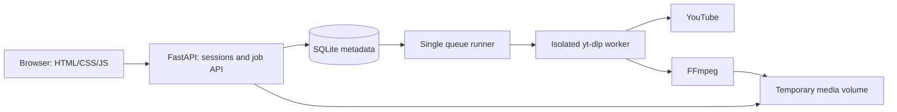

# Architecture

## Modules

| Module            | Responsibility                                                        |
| ----------------- | --------------------------------------------------------------------- |
| `app/config.py`   | Validated configuration and resource limits                           |
| `app/urls.py`     | Canonical single-video URL boundary                                   |
| `app/security.py` | Persistent signing key and bounded request bodies                     |
| `app/store.py`    | SQLite transactions, quotas, ownership, claims, and retention         |
| `app/files.py`    | Generated job directories, safe paths, size accounting, and cleanup   |
| `app/runner.py`   | One queue consumer, child lifecycle, deadlines, output checks         |
| `app/worker.py`   | yt-dlp metadata, download, FFmpeg postprocessing, structured progress |
| `app/main.py`     | HTTP endpoints, session/origin controls, static frontend              |
| `app/static/`     | Dependency-free bilingual browser UI                                  |

## Lifecycle

Jobs transition from `queued` to `downloading`, optionally `processing`, then `complete` or
`failed`. Active jobs can become `cancelled`. Terminal states are immutable. Each terminal
transition sets an expiry timestamp. A complete job owns exactly one downloadable MP4 or MP3.

Queue admission uses `BEGIN IMMEDIATE` so simultaneous requests cannot oversubscribe limits.
The runner claims one job at a time and invokes Python with a fixed argument list and a
canonical URL. No shell runs user input. Child stdout contains bounded JSON progress events;
provider messages are not exposed to visitors. Parent monitoring continues while FFmpeg works.

Failure is published after process termination and removal of partial files. Cancellation
updates the job immediately and waits for cleanup before responding. On startup, a file lock
prevents a second scheduler; interrupted active jobs become failed, expired records are removed,
and orphan/unfinished media directories are deleted. Completed unexpired files survive restart.

## Ownership and requests

`GET /api/session` creates or refreshes a random signed browser session. The signing key is
stored in the data directory, so restarts do not lose access to completed jobs. Each job route
looks up both job ID and session owner. The API never returns URLs, owner IDs, or internal paths.
Filename suggestions derive from sanitized titles; on-disk files use fixed generated names.

Host allowlisting precedes origin checks. Mutation bodies are limited to 4 KiB even with chunked
transfer encoding. `X-Requested-With: yt-downloader` is mandatory for mutations, foreign Origin
headers are rejected, and no cross-origin API access is enabled. File responses use attachment
disposition and `no-store`. HTTPS deployments must configure trusted proxies and Secure cookies.

## Capacity model

There is one worker, a queue of at most 12 active jobs, and at most 2 active jobs per browser.
Defaults cap source duration at 2 hours, final files at 500 MiB, a job directory at 1 GiB,
and all media at 5 GiB. Admission reserves space for one maximum job against currently retained
files; queued jobs are checked again when claimed. The deadline is 30 minutes. Limits are
configurable; polling-based byte controls may overshoot between samples, so public hosting also
needs a volume quota. Docker bounds CPU/RAM/PIDs and has an unprivileged, read-only root.

## Scaling boundary

Use one Uvicorn process and one data volume per instance. Multiple independent replicas would
need shared ownership/key strategy, a distributed queue, worker leases, shared media, and a
distributed rate limiter. Those are outside v0.1.0; do not scale by increasing `--workers`.
