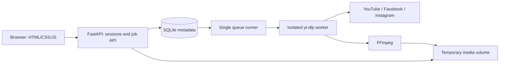

# Architecture

## Modules

| Module            | Responsibility                                                        |
| ----------------- | --------------------------------------------------------------------- |
| `app/config.py`   | Validated configuration and resource limits                           |
| `app/urls.py`     | Canonical single-video URL boundary                                   |
| `app/sources.py`  | Bounded share-link resolution and single-video extraction             |
| `app/media.py`    | Actual-duration validation and portrait-aware MP4 sizing               |
| `app/security.py` | Persistent signing key and bounded request bodies                     |
| `app/store.py`    | SQLite transactions, quotas, ownership, claims, and retention         |
| `app/policy.py`   | Effective personal, guest and free-account resource limits |
| `app/accounts.py` | Revocable sessions, browser-bound login transactions and account lifecycle |
| `app/oauth.py`    | Google OIDC and Facebook identity verification; no token persistence |
| `app/files.py`    | Generated job directories, safe paths, size accounting, and cleanup   |
| `app/runner.py`   | One queue consumer, child lifecycle, deadlines, output checks         |
| `app/worker.py`   | yt-dlp metadata, download, FFmpeg postprocessing, structured progress |
| `app/main.py`     | HTTP endpoints, session/origin controls, static frontend              |
| `app/static/`     | Dependency-free bilingual browser UI                                  |

## Lifecycle

Jobs transition from `queued` to `downloading`, optionally `processing`, then `complete` or
`failed`. Active jobs can become `cancelled`. Terminal states are immutable. Each terminal
transition sets an expiry timestamp. A complete job owns exactly one downloadable MP4 or MP3.

Queue admission uses `BEGIN IMMEDIATE` so simultaneous requests cannot oversubscribe limits.
The runner claims one job at a time and invokes Python with a fixed argument list and a
canonical URL. No shell runs user input. Child stdout contains bounded JSON progress events;
provider messages are not exposed to visitors. Parent monitoring continues while FFmpeg works.

The worker chooses a provider-specific extractor after validation. Raw extraction results are
inspected before yt-dlp processes them: collection results are rejected, and delegated URLs
must stay on the same provider and pass validation again. Share redirects run in the child,
never on the API event loop, and cannot request a host outside the allowlist.

Known excessive durations are rejected before media transfer. If a provider omits duration,
existing byte/time controls bound the transfer and ffprobe checks the actual result before
completion. Every MP4 and MP3 receives this final duration check. MP4 dimensions are measured;
larger renditions are scaled to the selected shorter-edge limit with orientation preserved.
MP4 normalization also enforces H.264/yuv420p and AAC-LC audio when present, regardless of
resolution. Compatible streams are remuxed without re-encoding; other streams are converted.
The MP4 index is moved before media data (faststart). A full strict FFmpeg decode verifies the
temporary output before it atomically replaces the downloaded file. Decode/conversion failures
become `processing_error` and cannot publish a completed job. All work remains inside the
worker's existing deadline and storage limits.

Failure is published after process termination; cleanup failures cannot leave the job active.
Cancellation updates the job immediately, stops its child and attempts cleanup. A separate
maintenance task runs during downloads, expires old queued work, removes expired/unfinished
media and prunes counters/sessions. Expired metadata is purged only after physical deletion.
Locked files keep their cleanup record for retry; an accepted stream holds a lease until its
response finishes. Manual deletion hides a terminal job immediately, then uses the same cleanup.
On startup, a file lock prevents a second scheduler and interrupted active jobs become failed.
Completed unexpired files survive restart. Downloader children inherit only a runtime environment
allowlist; OAuth client credentials are not passed to them.

## Ownership and requests

`GET /api/session` creates or reads an opaque browser session whose hash is stored in SQLite.
Legacy signed guest cookies migrate on first refresh. Guest owners and account owners isolate
jobs; sign-in rotates the session and moves guest jobs/usage to the account atomically. Logout
revokes the local token and all-device logout revokes every token for that account. Each job
route revalidates its session and looks up both job ID and owner. The API never returns source
URLs, owner IDs, OAuth tokens or internal paths. See [AUTHENTICATION.md](AUTHENTICATION.md).
Filename suggestions derive from sanitized titles; on-disk files use fixed generated names.

Host allowlisting precedes origin checks. Mutation bodies are limited to 4 KiB even with chunked
transfer encoding. `X-Requested-With: yt-downloader` is mandatory for mutations, foreign Origin
headers are rejected, and no cross-origin API access is enabled. Files use attachment disposition;
the owned preview endpoint uses inline disposition with byte-range support. Both use `no-store`.
HTTPS deployments must configure trusted proxies and Secure cookies.

Job admission atomically checks global queue, account/session active slots, peer burst,
public IP daily cap and guest/account rolling budgets. Accepted jobs snapshot their effective
duration and output-byte limits, so login/config changes do not upgrade work already queued.
An optional per-owner idempotency key returns an existing unexpired job without charging twice.
Retries create a new job and pass the same admission checks. See [LIMITS.md](LIMITS.md).

The frontend uses keyed job cards; polling updates progress/text without replacing a player or
focused action. Requests have a deadline, 401 responses trigger coalesced session recovery, and
poll failures use bounded backoff. Ambiguous POST failures retain an in-memory idempotency key;
source URLs are never stored in localStorage. Only language, format and quality are persisted.

## Capacity model

There is one worker, a queue of at most 12 active jobs, and at most 2 active jobs per browser.
Defaults cap source duration at 2 hours, final files at 500 MiB, a job directory at 1 GiB,
and all media at 5 GiB. Admission reserves space for one maximum job against currently retained
files; queued jobs are checked again when claimed. The deadline is 30 minutes. Limits are
configurable; polling-based byte controls may overshoot between samples, so public hosting also
needs a volume quota. Docker bounds CPU/RAM/PIDs and has an unprivileged, read-only root.

## Scaling boundary

Use one Uvicorn process and one data volume per instance. Multiple independent replicas would
need shared ownership/key strategy, a distributed queue, worker leases, shared media, and a
distributed rate limiter. Those are outside v0.1.0; do not scale by increasing `--workers`.
